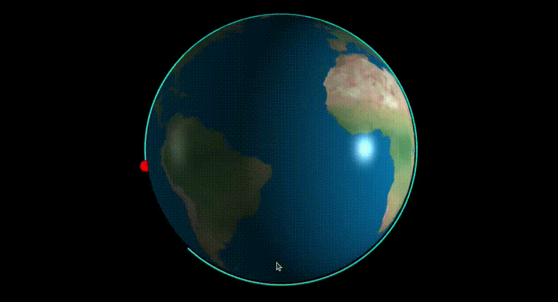

# 🌌 Orbital Mechanics Simulator (Artemis Generation) 🚀✨

<p align="center">
  
</p>


---

### 📖 Introducción 🌠

Este simulador de mecánica orbital en **Baja Órbita Terrestre (LEO)** es un proyecto desarrollado como parte de mi formación en **Software Development** 💻. Integra conceptos de física clásica con computación de alto nivel para visualizar trayectorias satelitales y entender las fuerzas gravitatorias que rigen la exploración espacial moderna 🛰️🌍.

---

## 🚀 Características Principales ✨

* **🎮 Visualización Interactiva 3D:** Renderizado en tiempo real con `VPython`, incluyendo texturas planetarias e iluminación dinámica ☀️.
* **🧪 Física de Precisión:** Cálculo de trayectorias basado en la Ley de Gravitación Universal de Newton 🍎.
* **📈 Análisis Vectorial:** Representación de vectores de velocidad, posición y aceleración en un entorno tridimensional.
* **🐧 Optimización para Linux:** Flujo de trabajo integrado en entornos Debian/Ubuntu, utilizando `Tilix` y `Git` 🛠️.

## 🛠️ Stack Tecnológico 🧰

| Componente | Tecnología | Icono |
| :--- | :--- | :---: |
| **Lenguaje** | Python 3.12 | 🐍 |
| **Gráficos 3D** | VPython | 📦 |
| **Cálculo Numérico** | NumPy | 🔢 |
| **Gráficas 2D** | Matplotlib | 📊 |
| **Entorno** | Linux (Ubuntu) | 🐧 |

---

## 🔧 Instalación y Despliegue ⚙️

Para ejecutar este simulador en tu entorno local, sigue estos pasos:

1. **📥 Clonar el repositorio:**
   ```bash
   git clone [https://github.com/keniastefanyherr/Orbital-mechanics-simulator-.git](https://github.com/keniastefanyherr/Orbital-mechanics-simulator-.git)
   cd Orbital-mechanics-simulator-
